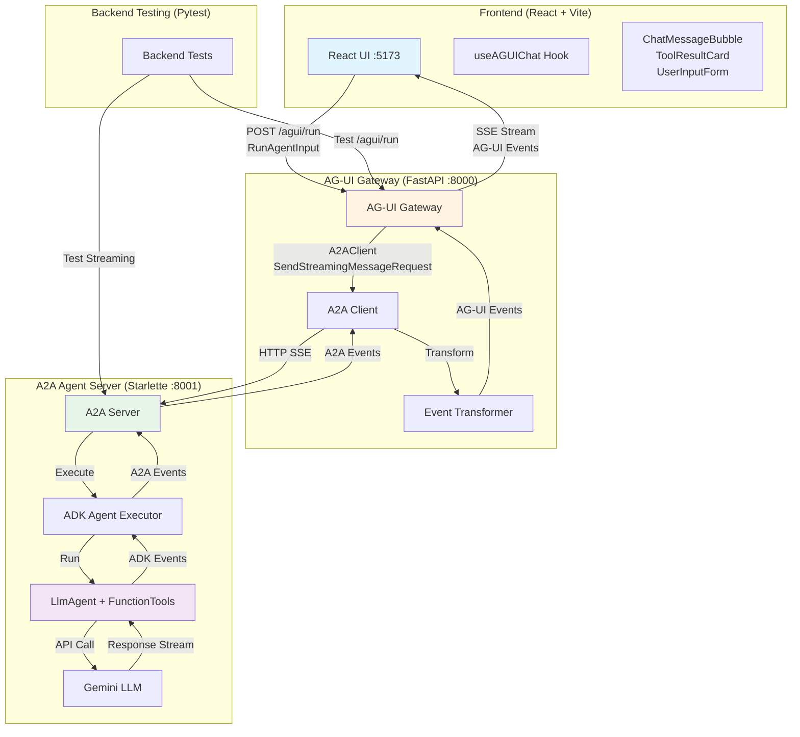
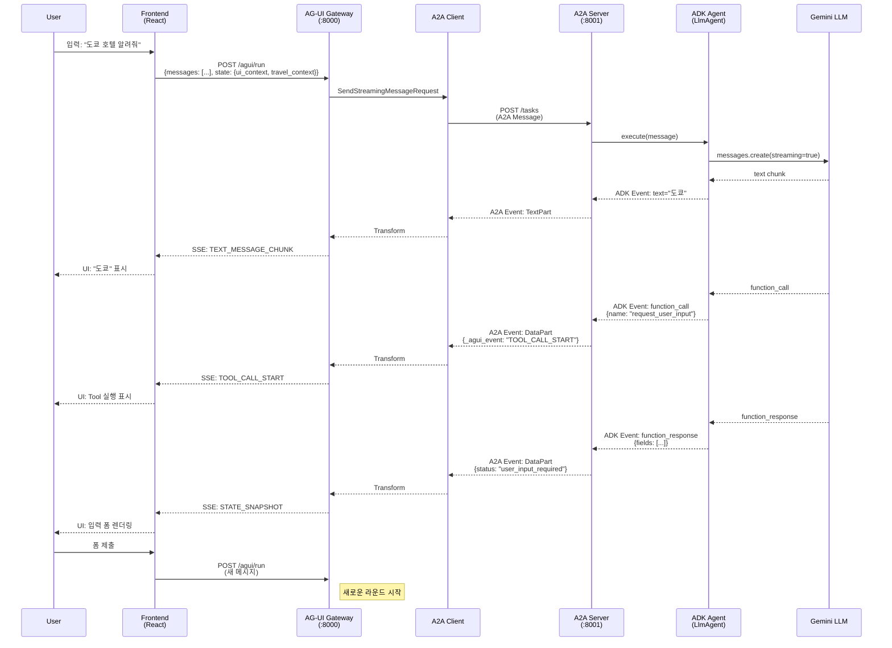
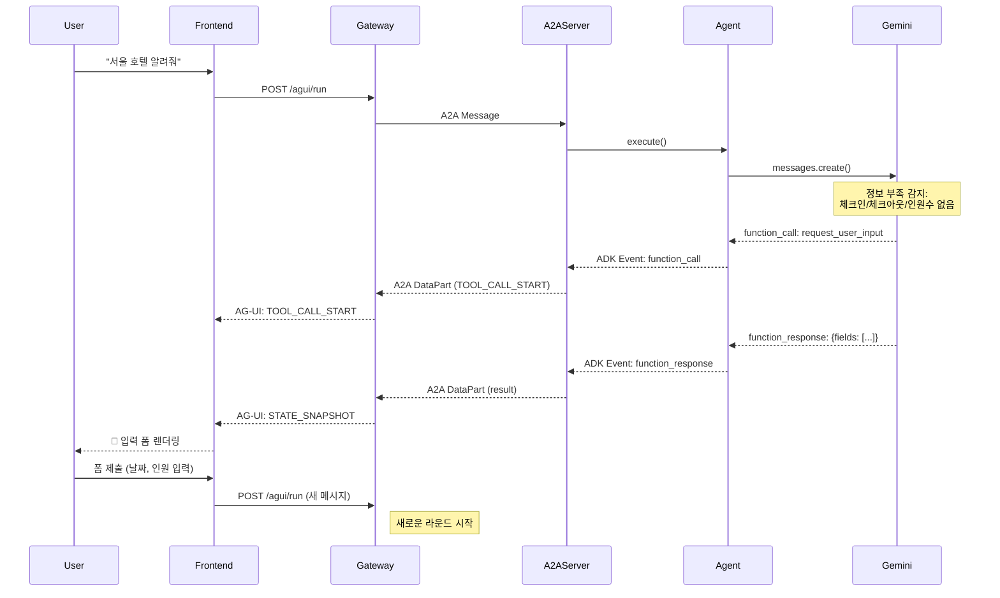

# A2A → AG-UI → Frontend 통신 흐름 상세 가이드

이 문서는 여행 AI 프로젝트에서 **A2A Protocol**, **AG-UI Protocol**, **Frontend UI**가 어떻게 통신하고 데이터를 변환하는지 코드 레벨에서 상세히 설명합니다.

---

## 목차

1. [아키텍처 개요](#아키텍처-개요)
2. [전체 통신 흐름](#전체-통신-흐름)
3. [레이어별 상세 분석](#레이어별-상세-분석)
   - Frontend Layer
   - State Management Layer
   - AG-UI Gateway Layer
   - A2A Server Layer
   - ADK Agent Layer
4. [이벤트 변환 과정](#이벤트-변환-과정)
5. [실제 예시](#실제-예시)
6. [디버깅 가이드](#디버깅-가이드)

---

## 아키텍처 개요

### 3계층 아키텍처



### 프로토콜 스택

| 레이어 | 프로토콜 | 포트 | 역할 |
|--------|---------|------|------|
| **Frontend** | HTTP/SSE | 5173 | AG-UI 이벤트 수신 → UI 렌더링 |
| **AG-UI Gateway** | AG-UI Protocol | 8000 | A2A ↔ AG-UI 이벤트 변환 |
| **A2A Server** | A2A Protocol | 8001 | ADK 에이전트를 A2A로 노출 |
| **ADK Agent** | Google ADK | - | LLM + FunctionTools 실행 |
| **Backend Tests** | Pytest / Async | - | SSE 스트림 및 API 로직 검증 |
| **E2E Tests** | Playwright | - | 프론트엔드-백엔드 통합 시나리오 검증 |

---

## 전체 통신 흐름

### 시퀀스 다이어그램



---

## 레이어별 상세 분석

### 1. Frontend Layer (React + Vite)

#### 1.1 사용자 메시지 전송

**파일**: `frontend/src/hooks/useAGUIChat.ts`

```typescript
const sendMessage = async (content: string) => {
  const userMessage: UserMessage = {
    id: generateId(),
    role: 'user',
    content,
    timestamp: Date.now(),
  };

  // UI에 사용자 메시지 즉시 추가
  setMessages(prev => [...prev, userMessage]);

  // AG-UI 게이트웨이로 전송 (travel_context 포함)
  const clientState = {
    ui_context: uiContext,
    session_prefs: { currency: 'KRW', language: 'ko' },
    travel_context: agentState?.travel_context ?? null,  // 호텔↔항공 날짜 재사용
  };

  const response = await fetch('/agui/run', {
    method: 'POST',
    headers: { 'Content-Type': 'application/json' },
    body: JSON.stringify({
      threadId: threadId || generateId(),
      runId: generateId(),
      state: clientState,
      messages: [
        ...messages.map(m => ({ role: m.role, content: m.content })),
        { role: 'user', content }
      ],
    }),
  });

  // SSE 스트림 시작
  const reader = response.body.getReader();
  const decoder = new TextDecoder();

  while (true) {
    const { done, value } = await reader.read();
    if (done) break;

    const chunk = decoder.decode(value);
    const lines = chunk.split('\n');

    for (const line of lines) {
      if (line.startsWith('data: ')) {
        const data = line.slice(6);
        const event = JSON.parse(data);

        // AG-UI 이벤트 처리
        handleAGUIEvent(event);
      }
    }
  }
};
```

#### 1.2 AG-UI 이벤트 처리

```typescript
const handleAGUIEvent = (event: any) => {
  switch (event.type) {
    case 'RUN_STARTED':
      console.log('Run started:', event.runId);
      break;

    case 'TEXT_MESSAGE_START':
      // 새 어시스턴트 메시지 시작
      setMessages(prev => [...prev, {
        id: event.messageId,
        role: 'assistant',
        content: '',
        timestamp: Date.now(),
      }]);
      break;

    case 'TEXT_MESSAGE_CHUNK':
      // 텍스트 스트리밍
      setMessages(prev => prev.map(m =>
        m.id === event.messageId
          ? { ...m, content: m.content + event.delta }
          : m
      ));
      break;

    case 'TOOL_CALL_START':
      // 툴 실행 시작
      setToolCalls(prev => [...prev, {
        id: event.toolCallId,
        name: event.toolCallName,
        status: 'running',
        args: {},
      }]);
      break;

    case 'TOOL_CALL_ARGS':
      // 툴 인자 수신
      setToolCalls(prev => prev.map(tc =>
        tc.id === event.toolCallId
          ? { ...tc, args: { ...tc.args, ...JSON.parse(event.delta) } }
          : tc
      ));
      break;

    case 'STATE_SNAPSHOT':
      if (snapshot.snapshot_type === 'agent_state') {
        // 핵심 여행 정보(destination, check_in, check_out, nights, guests, origin, trip_type)는
        // null로 덮어쓰지 않음 → 호텔 상세 조회 등 부분 업데이트 시 기존 값 보호
        const PERSISTENT_FIELDS = ['destination','check_in','check_out','nights','guests','origin','trip_type'];
        setAgentState(prev => {
          const merged = { ...prev?.travel_context };
          for (const [key, value] of Object.entries(snapshot.travel_context)) {
            if (PERSISTENT_FIELDS.includes(key) && value === null && merged[key] != null) continue;
            merged[key] = value;
          }
          return { travel_context: merged, agent_status: snapshot.agent_status };
        });
      } else {
        // tool_result → ToolResultCard 렌더링
        updateMessage(assistantId, m => ({ ...m, snapshots: [...m.snapshots, snapshot] }));
      }
      break;

    case 'USER_FAVORITE_REQUEST':
      // 취향 수집 패널 표시
      setPendingFavoriteRequest({
        requestId: event.requestId,
        favoriteType: event.favoriteType,
        options: event.options,
        submitted: false,
      });
      break;

    case 'RUN_FINISHED':
      console.log('Run finished');
      break;
  }
};
```

#### 1.3 UI 렌더링

#### 1.4 State Flow 패널

**StatePanel 컴포넌트**: `frontend/src/components/StatePanel.tsx`

사용자가 한눈에 현재 여행 상태를 확인할 수 있도록 3개 섹션으로 구성됩니다.

| 섹션 | 내용 | 특징 |
|------|------|------|
| 📌 핵심 여행 정보 | 도착지·출발지·체크인/아웃·숙박·인원·여행유형 | null로 초기화되지 않는 고정 값 |
| ↑ CLIENT → SERVER | 선택 호텔·항공편·현재 화면·통화·언어 | 사용자 액션으로 변경되는 값 |
| ↓ SERVER → CLIENT | 인텐트·실행 도구·미입력 항목 | 에이전트 처리 상태 |

값이 변경될 때 해당 필드가 0.5초 하이라이트되어 어떤 값이 업데이트됐는지 시각적으로 표시됩니다.

---

#### 1.5 UI 렌더링

**ToolResultCard 컴포넌트**: `frontend/src/components/ToolResultCard.tsx`

```tsx
export function ToolResultCard({ result }: { result: any }) {
  if (result.tool === 'search_hotels' && result.result?.hotels) {
    return (
      <div className="hotels-result">
        <h3>🏨 {result.result.city} 호텔 검색 결과</h3>
        <p>체크인: {result.result.check_in} | 체크아웃: {result.result.check_out}</p>
        <p>인원: {result.result.guests}명</p>

        <div className="hotel-list">
          {result.result.hotels.map((hotel, idx) => (
            <div key={idx} className="hotel-card">
              <h4>{hotel.name}</h4>
              <p>⭐ {hotel.rating} | {'⭐'.repeat(hotel.stars)}</p>
              <p>📍 {hotel.area}</p>
              <p className="price">₩{hotel.price.toLocaleString()} / 박</p>
            </div>
          ))}
        </div>
      </div>
    );
  }

  if (result.status === 'user_input_required') {
    return <UserInputForm fields={result.fields} onSubmit={handleSubmit} />;
  }

  return null;
}
```

---

### 2. State Management Layer

**핵심 역할**: `StateManager`는 싱글톤으로 `main.py`와 `executor.py` 간에 공유되며, `thread_id` 기준으로 `TravelState`(TravelContext + UIContext + AgentStatus)를 통합 관리합니다.

**파일**: `backend/state/manager.py`, `backend/state/models.py`

#### 2.1 StateManager 메서드

- `get(thread_id)` → 현재 `TravelState` 반환
- `apply_client_state(thread_id, raw_state)` → 클라이언트 상태 적용, `StateSnapshotEvent` yield (메인 레이어에서 SSE로 직접 인코딩)
- `apply_tool_call(thread_id, tool_name, args)` → 툴 호출 반영, `StateSnapshotEvent` yield (executor에서 `TaskArtifactUpdateEvent(DataPart)` 래핑)
- `apply_tool_result(thread_id, tool_name, result)` → 툴 결과 반영
- `get_tc_id(thread_id, tool_name)` → 특정 tool_call의 ID 반환
- `clear(thread_id)` → 스레드 정리

#### 2.2 SSE 인코딩 흐름

1. **apply_client_state** (main.py에서 호출)
   - 클라이언트 상태 수신 → `StateSnapshotEvent` yield
   - Main은 이를 직접 AG-UI `STATE_SNAPSHOT` 이벤트로 인코딩 → SSE 전송

2. **apply_tool_call / apply_tool_result** (executor.py에서 호출)
   - 도구 호출/결과 발생 → `StateSnapshotEvent` yield
   - Executor는 이를 `TaskArtifactUpdateEvent(DataPart)` 래핑 → A2AServer에 enqueue
   - Main의 A2A 변환기가 `DataPart` → `STATE_SNAPSHOT` 이벤트 변환

3. **특수 케이스: request_user_input**
   - `status == "user_input_required"` → `snapshot_type: "user_input_request"`로 마킹
   - Main은 `_agui_event: "USER_INPUT_REQUEST"` DataPart로 인코딩 → 프론트에서 폼 렌더링

---

### 3. AG-UI Gateway Layer (FastAPI)

#### 3.1 요청 수신 및 A2A 호출

**파일**: `backend/main.py`

```python
from fastapi import FastAPI
from fastapi.responses import StreamingResponse
from a2a_sdk import A2AClient, SendStreamingMessageRequest, MessageSendParams
import httpx

app = FastAPI()

# A2A 클라이언트 초기화
http_client = httpx.AsyncClient(timeout=60.0)
a2a_client = A2AClient(
    httpx_client=http_client,
    agent_card=agent_card  # A2A 서버의 AgentCard
)

@app.post("/agui/run")
async def handle_run(body: dict):
    """AG-UI RunAgentInput 수신 → travel_context 주입 → A2A 호출 → AG-UI 이벤트 스트리밍"""

    # 1. 메시지 ID 자동 부여 (AG-UI 요구사항)
    for msg in body["messages"]:
        if isinstance(msg, dict) and "id" not in msg:
            msg["id"] = str(uuid.uuid4())

    # 2. travel_context가 있으면 사용자 메시지 앞에 컨텍스트 블록 주입
    #    → 에이전트가 기존 날짜·인원을 인지하고 호텔↔항공편 전환 시 재사용
    client_state = body.get("state") or {}
    travel_context = client_state.get("travel_context") or {}
    ctx_lines = []
    if travel_context.get("destination"): ctx_lines.append(f"- 목적지: {travel_context['destination']}")
    if travel_context.get("check_in"):    ctx_lines.append(f"- 체크인/출발일: {travel_context['check_in']}")
    if travel_context.get("check_out"):   ctx_lines.append(f"- 체크아웃/귀국일: {travel_context['check_out']}")
    if travel_context.get("guests"):      ctx_lines.append(f"- 인원: {travel_context['guests']}명")

    if ctx_lines:
        context_block = "[현재 여행 컨텍스트 - 이미 확인된 정보]\n" + "\n".join(ctx_lines)
        user_message = f"{context_block}\n\n사용자 요청: {user_message}"

    # 3. A2A SendStreamingMessageRequest 생성
    request = SendStreamingMessageRequest(
        id=body.get("runId", str(uuid.uuid4())),
        params=MessageSendParams(
            messages=[
                {"role": m["role"], "parts": [{"text": m["content"]}]}
                for m in body["messages"]
            ]
        )
    )

    # 3. SSE 스트리밍 응답 생성
    async def generate_agui_events():
        # RUN_STARTED 이벤트
        yield f'data: {json.dumps({"type": "RUN_STARTED", "runId": body["runId"]})}\n\n'

        # A2A 스트리밍 시작
        async for a2a_response in a2a_client.send_message_streaming(request):
            result = a2a_response.root.result

            # A2A 이벤트 → AG-UI 이벤트 변환
            for agui_event in transform_a2a_to_agui(result):
                yield f'data: {json.dumps(agui_event)}\n\n'

        # RUN_FINISHED 이벤트
        yield f'data: {json.dumps({"type": "RUN_FINISHED"})}\n\n'

    return StreamingResponse(
        generate_agui_events(),
        media_type="text/event-stream"
    )
```

#### 3.2 A2A → AG-UI 이벤트 변환

```python
def transform_a2a_to_agui(a2a_result):
    """A2A 이벤트를 AG-UI 이벤트로 변환"""

    # Task 객체 (메타데이터)
    if hasattr(a2a_result, 'id'):
        pass  # Task는 AG-UI에서 사용하지 않음

    # TaskStatusUpdateEvent (working/completed)
    elif isinstance(a2a_result, TaskStatusUpdateEvent):
        if a2a_result.state == 'working':
            yield {
                "type": "STEP_STARTED",
                "stepName": "에이전트 처리 중"
            }
        elif a2a_result.state == 'completed':
            yield {
                "type": "STEP_FINISHED"
            }

    # Message (완료된 메시지)
    elif isinstance(a2a_result, Message):
        pass  # AG-UI는 스트리밍 중에는 사용하지 않음

    # TaskArtifactUpdateEvent (파트 스트리밍)
    elif isinstance(a2a_result, TaskArtifactUpdateEvent):
        for part in a2a_result.artifact.parts:

            # TextPart → TEXT_MESSAGE_*
            if hasattr(part, 'text'):
                if not hasattr(transform_a2a_to_agui, 'current_message_id'):
                    # TEXT_MESSAGE_START
                    message_id = str(uuid.uuid4())
                    transform_a2a_to_agui.current_message_id = message_id
                    yield {
                        "type": "TEXT_MESSAGE_START",
                        "messageId": message_id,
                        "role": "assistant"
                    }

                # TEXT_MESSAGE_CHUNK
                yield {
                    "type": "TEXT_MESSAGE_CHUNK",
                    "messageId": transform_a2a_to_agui.current_message_id,
                    "delta": part.text
                }

            # DataPart → TOOL_CALL_* 또는 STATE_SNAPSHOT
            elif hasattr(part, 'data'):
                data = part.data

                # TOOL_CALL_START (ADK function_call 시작 신호)
                if data.get('_agui_event') == 'TOOL_CALL_START':
                    yield {
                        "type": "TOOL_CALL_START",
                        "toolCallId": data['id'],
                        "toolCallName": data['name']
                    }

                    # TOOL_CALL_ARGS
                    yield {
                        "type": "TOOL_CALL_ARGS",
                        "toolCallId": data['id'],
                        "delta": json.dumps(data['args'])
                    }

                # TOOL_CALL_END (ADK function_response 종료 신호)
                elif data.get('_agui_event') == 'TOOL_CALL_END':
                    yield {
                        "type": "TOOL_CALL_END",
                        "toolCallId": data['id']
                    }

                # STATE_SNAPSHOT (툴 실행 결과)
                else:
                    yield {
                        "type": "STATE_SNAPSHOT",
                        "snapshot": data
                    }

        # 메시지 완료 시 TEXT_MESSAGE_END
        if hasattr(transform_a2a_to_agui, 'current_message_id'):
            yield {
                "type": "TEXT_MESSAGE_END",
                "messageId": transform_a2a_to_agui.current_message_id
            }
            del transform_a2a_to_agui.current_message_id
```

---

### 4. A2A Server Layer (Starlette)

#### 4.1 A2A 서버 초기화

**파일**: `backend/a2a_server.py`

```python
from a2a.server import A2AStarletteApplication, DefaultRequestHandler
from a2a.server.agent_execution import AgentExecutor, RequestContext, EventQueue
from a2a.types import AgentCard, AgentCapabilities, AgentSkill
from a2a.storage import InMemoryTaskStore
from google.adk.agents import LlmAgent
from google.adk.runner import Runner

# AgentCard 정의 (A2A 프로토콜 필수)
agent_card = AgentCard(
    name="Travel AI Agent",
    description="여행 계획을 도와주는 AI 에이전트",
    url="http://localhost:8001/",
    version="1.0.0",
    default_input_modes=["text/plain"],
    default_output_modes=["text/plain"],
    capabilities=AgentCapabilities(streaming=True),
    skills=[
        AgentSkill(
            id="hotel_search",
            name="호텔 검색",
            description="도시와 날짜로 호텔을 검색합니다",
            tags=["travel", "hotel"]
        ),
        AgentSkill(
            id="flight_search",
            name="항공편 검색",
            description="출발지와 목적지로 항공편을 검색합니다",
            tags=["travel", "flight"]
        ),
        AgentSkill(
            id="travel_tips",
            name="여행 정보",
            description="목적지의 여행 팁과 관광지 정보를 제공합니다",
            tags=["travel", "information"]
        ),
    ]
)

# ADK Agent Executor (커스텀 구현)
class ADKAgentExecutor(AgentExecutor):
    """ADK 이벤트를 A2A 이벤트로 변환하는 Executor"""

    def __init__(self, agent: LlmAgent):
        self.agent = agent
        self.runner = Runner(agent)

    async def execute(self, context: RequestContext, event_queue: EventQueue):
        """에이전트 실행 및 A2A 이벤트 스트리밍"""

        # 메시지 추출
        messages = []
        for msg in context.messages:
            for part in msg.parts:
                if hasattr(part, 'text'):
                    messages.append({
                        "role": msg.role,
                        "content": part.text
                    })

        # 현재 메시지
        current_message = messages[-1]["content"] if messages else ""

        # TaskStatusUpdateEvent: working
        await event_queue.push(TaskStatusUpdateEvent(
            task_id=context.task_id,
            state='working'
        ))

        # ADK Runner 스트리밍 실행
        async for event in self.runner.run_async(current_message):

            # ADK 'text' 이벤트 → A2A TextPart
            if event.type == 'text':
                await event_queue.push(TaskArtifactUpdateEvent(
                    task_id=context.task_id,
                    artifact=Artifact(parts=[TextPart(text=event.text)])
                ))

            # ADK 'function_call' 이벤트 → A2A DataPart (TOOL_CALL_START)
            elif event.type == 'function_call':
                await event_queue.push(TaskArtifactUpdateEvent(
                    task_id=context.task_id,
                    artifact=Artifact(parts=[DataPart(data={
                        "_agui_event": "TOOL_CALL_START",
                        "id": str(uuid.uuid4()),
                        "name": event.name,
                        "args": event.args
                    })])
                ))

            # ADK 'function_response' 이벤트
            elif event.type == 'function_response':
                # TOOL_CALL_END 신호
                await event_queue.push(TaskArtifactUpdateEvent(
                    task_id=context.task_id,
                    artifact=Artifact(parts=[DataPart(data={
                        "_agui_event": "TOOL_CALL_END",
                        "id": event.call_id
                    })])
                ))

                # 툴 실행 결과
                await event_queue.push(TaskArtifactUpdateEvent(
                    task_id=context.task_id,
                    artifact=Artifact(parts=[DataPart(data={
                        "tool": event.name,
                        "result": event.result
                    })])
                ))

        # TaskStatusUpdateEvent: completed
        await event_queue.push(TaskStatusUpdateEvent(
            task_id=context.task_id,
            state='completed'
        ))

# A2A 애플리케이션 생성
executor = ADKAgentExecutor(agent)

a2a_app = A2AStarletteApplication(
    agent_card=agent_card,
    http_handler=DefaultRequestHandler(
        agent_executor=executor,
        task_store=InMemoryTaskStore()  # 필수
    )
)

# Starlette ASGI 앱 생성
app = a2a_app.build()

if __name__ == "__main__":
    import uvicorn
    uvicorn.run(app, host="0.0.0.0", port=8001)
```

---

### 5. ADK Agent Layer (Google ADK)

#### 5.1 에이전트 정의

**파일**: `backend/agent.py`

```python
from google.adk.agents import LlmAgent
from google.adk.tools import FunctionTool

def search_hotels(city: str, check_in: str, check_out: str, guests: int = 2) -> dict:
    """호텔 검색 함수"""
    # 하드코딩된 호텔 데이터베이스
    hotel_db = {
        "도쿄": [
            {"name": "파크 하얏트 도쿄", "area": "신주쿠", "price": 420000, "rating": 4.8, "stars": 5},
            {"name": "더 프린스 갤러리 도쿄", "area": "긴자", "price": 380000, "rating": 4.7, "stars": 5},
        ],
    }

    matched_city = None
    for key in hotel_db:
        if key in city or city in key:
            matched_city = key
            break

    if not matched_city:
        return {"status": "not_found", "message": f"{city}에 대한 호텔 정보를 찾을 수 없습니다."}

    hotels = hotel_db[matched_city]
    return {
        "status": "success",
        "city": matched_city,
        "check_in": check_in,
        "check_out": check_out,
        "guests": guests,
        "hotels": hotels
    }

def request_user_input(input_type: str, fields: str = "", context: str = "") -> dict:
    """사용자 입력 폼 요청"""
    from datetime import datetime, timedelta

    if input_type == "hotel_booking_details":
        check_in_date = datetime.now() + timedelta(weeks=3)
        check_out_date = check_in_date + timedelta(days=1)

        return {
            "status": "user_input_required",
            "input_type": input_type,
            "fields": [
                {"name": "city", "type": "text", "label": "도시", "required": True, "default": context},
                {"name": "check_in", "type": "date", "label": "체크인", "required": True,
                 "default": check_in_date.strftime("%Y-%m-%d")},
                {"name": "check_out", "type": "date", "label": "체크아웃", "required": True,
                 "default": check_out_date.strftime("%Y-%m-%d")},
                {"name": "guests", "type": "number", "label": "인원수", "required": True, "default": "2"}
            ]
        }

def create_travel_agent() -> LlmAgent:
    """여행 에이전트 생성"""
    agent = LlmAgent(
        name="travel_agent",
        model="gemini-2.0-flash-exp",
        description="여행 AI 여행 상담 에이전트",
        instruction="""당신은 여행 AI의 AI 여행 상담 전문가입니다.

도구 사용 가이드:
- 호텔 문의 시:
  1) 도시만 언급됨 → request_user_input("hotel_booking_details", "", "도시명")
  2) 모든 정보 있음 → search_hotels(city, check_in, check_out, guests)
- 항공편 문의 시:
  1) 출발지나 목적지만 언급됨 → request_user_input("flight_booking_details", "", "출발지|목적지")
  2) 모든 정보 있음 → search_flights(origin, destination, departure_date, passengers, return_date)
- 여행지 정보 → get_travel_tips(destination)

예시:
"서울 호텔 알려줘" → request_user_input("hotel_booking_details", "", "서울")
"도쿄 6월 10일부터 14일까지 2명" → search_hotels("도쿄", "2026-06-10", "2026-06-14", 2)
""",
        tools=[
            FunctionTool(request_user_input),
            FunctionTool(search_hotels),
            FunctionTool(search_flights),
            FunctionTool(get_travel_tips),
        ],
    )

    return agent
```

---

## 이벤트 변환 과정

### ADK 이벤트 → A2A Part

| ADK Event Type | A2A Part Type | 데이터 구조 | 설명 |
|---------------|---------------|------------|------|
| `text` | `TextPart` | `{text: "호텔을 검색 중입니다..."}` | LLM 텍스트 스트리밍 |
| `function_call` | `DataPart` | `{_agui_event: "TOOL_CALL_START", id, name, args}` | 툴 호출 시작 신호 |
| `function_response` (start) | `DataPart` | `{_agui_event: "TOOL_CALL_END", id}` | 툴 호출 종료 신호 |
| `function_response` (result) | `DataPart` | `{tool: "search_hotels", result: {...}}` | 툴 실행 결과 |
| `request_user_favorite` | `DataPart` | `{_agui_event: "USER_FAVORITE_REQUEST", requestId, favoriteType, options}` | 취향 수집 요청 |

### A2A Event → AG-UI Event

| A2A Event Type | AG-UI Event Type | 변환 규칙 |
|---------------|------------------|----------|
| `TaskStatusUpdateEvent(working)` | `STEP_STARTED` | 에이전트 실행 시작 |
| `TaskStatusUpdateEvent(completed)` | `STEP_FINISHED` | 에이전트 실행 완료 |
| `TaskArtifactUpdateEvent(TextPart)` | `TEXT_MESSAGE_START`<br/>`TEXT_MESSAGE_CHUNK`<br/>`TEXT_MESSAGE_END` | 텍스트 스트리밍 |
| `TaskArtifactUpdateEvent(DataPart)`<br/>with `_agui_event=TOOL_CALL_START` | `TOOL_CALL_START`<br/>`TOOL_CALL_ARGS` | 툴 호출 시작 |
| `TaskArtifactUpdateEvent(DataPart)`<br/>with `_agui_event=TOOL_CALL_END` | `TOOL_CALL_END` | 툴 호출 종료 |
| `TaskArtifactUpdateEvent(DataPart)`<br/>with `_agui_event=USER_FAVORITE_REQUEST` | `USER_FAVORITE_REQUEST` | 취향 수집 패널 렌더링 |
| `TaskArtifactUpdateEvent(DataPart)`<br/>(other) | `STATE_SNAPSHOT` | 툴 결과 또는 상태 |

---

## 실제 예시

### 예시 1: 호텔 검색 (완전한 정보)

**사용자 입력**: "도쿄 호텔 추천해줘 (6월 10일~14일, 2명)"

#### 1단계: Frontend → AG-UI Gateway

```http
POST http://localhost:8000/agui/run
Content-Type: application/json

{
  "threadId": "thread-123",
  "runId": "run-456",
  "messages": [
    {
      "id": "msg-1",
      "role": "user",
      "content": "도쿄 호텔 추천해줘 (6월 10일~14일, 2명)"
    }
  ]
}
```

#### 2단계: AG-UI Gateway → A2A Server

```python
# A2A SendStreamingMessageRequest
{
  "id": "run-456",
  "params": {
    "messages": [
      {
        "role": "user",
        "parts": [{"text": "도쿄 호텔 추천해줘 (6월 10일~14일, 2명)"}]
      }
    ]
  }
}
```

#### 3단계: A2A Server → ADK Agent

```python
# ADK runner.run_async()
async for event in runner.run_async("도쿄 호텔 추천해줘 (6월 10일~14일, 2명)"):
    # Event 1: text
    # {"type": "text", "text": "도쿄의 호텔을 검색하겠습니다."}

    # Event 2: function_call
    # {"type": "function_call", "name": "search_hotels",
    #  "args": {"city": "도쿄", "check_in": "2026-06-10", "check_out": "2026-06-14", "guests": 2}}

    # Event 3: function_response
    # {"type": "function_response", "name": "search_hotels",
    #  "result": {"status": "success", "hotels": [...]}}

    # Event 4: text
    # {"type": "text", "text": "도쿄에 3개의 호텔을 찾았습니다."}
```

#### 4단계: ADK Event → A2A Event

```python
# A2A Events (스트림)
[
  # TaskStatusUpdateEvent
  {"type": "TaskStatusUpdateEvent", "state": "working"},

  # TextPart
  {"type": "TaskArtifactUpdateEvent", "parts": [{"text": "도쿄의 호텔을 검색하겠습니다."}]},

  # DataPart (TOOL_CALL_START)
  {"type": "TaskArtifactUpdateEvent", "parts": [{"data": {
    "_agui_event": "TOOL_CALL_START",
    "id": "tool-1",
    "name": "search_hotels",
    "args": {"city": "도쿄", "check_in": "2026-06-10", "check_out": "2026-06-14", "guests": 2}
  }}]},

  # DataPart (TOOL_CALL_END)
  {"type": "TaskArtifactUpdateEvent", "parts": [{"data": {
    "_agui_event": "TOOL_CALL_END",
    "id": "tool-1"
  }}]},

  # DataPart (Result)
  {"type": "TaskArtifactUpdateEvent", "parts": [{"data": {
    "tool": "search_hotels",
    "result": {
      "status": "success",
      "city": "도쿄",
      "hotels": [
        {"name": "파크 하얏트 도쿄", "price": 420000, ...},
        {"name": "더 프린스 갤러리 도쿄", "price": 380000, ...}
      ]
    }
  }}]},

  # TextPart
  {"type": "TaskArtifactUpdateEvent", "parts": [{"text": "도쿄에 3개의 호텔을 찾았습니다."}]},

  # TaskStatusUpdateEvent
  {"type": "TaskStatusUpdateEvent", "state": "completed"}
]
```

#### 5단계: A2A Event → AG-UI Event

```javascript
// AG-UI Events (SSE 스트림)
data: {"type":"RUN_STARTED","runId":"run-456"}

data: {"type":"STEP_STARTED","stepName":"에이전트 처리 중"}

data: {"type":"TEXT_MESSAGE_START","messageId":"msg-2","role":"assistant"}

data: {"type":"TEXT_MESSAGE_CHUNK","messageId":"msg-2","delta":"도쿄의 호텔을 검색하겠습니다."}

data: {"type":"TOOL_CALL_START","toolCallId":"tool-1","toolCallName":"search_hotels"}

data: {"type":"TOOL_CALL_ARGS","toolCallId":"tool-1","delta":"{\"city\":\"도쿄\",\"check_in\":\"2026-06-10\",\"check_out\":\"2026-06-14\",\"guests\":2}"}

data: {"type":"TOOL_CALL_END","toolCallId":"tool-1"}

data: {"type":"STATE_SNAPSHOT","snapshot":{"tool":"search_hotels","result":{"status":"success","hotels":[...]}}}

data: {"type":"TEXT_MESSAGE_CHUNK","messageId":"msg-2","delta":"도쿄에 3개의 호텔을 찾았습니다."}

data: {"type":"TEXT_MESSAGE_END","messageId":"msg-2"}

data: {"type":"STEP_FINISHED"}

data: {"type":"RUN_FINISHED"}
```

#### 6단계: Frontend UI 렌더링

```
┌─────────────────────────────────────────┐
│ 사용자                                    │
│ 도쿄 호텔 추천해줘 (6월 10일~14일, 2명)      │
└─────────────────────────────────────────┘

┌─────────────────────────────────────────┐
│ AI 어시스턴트                              │
│ 도쿄의 호텔을 검색하겠습니다.               │
│                                           │
│ 🔧 search_hotels 실행 중...               │
│                                           │
│ ┌──────────────────────────────────────┐ │
│ │ 🏨 도쿄 호텔 검색 결과                 │ │
│ │ 체크인: 2026-06-10 | 체크아웃: 2026-06-14 │ │
│ │ 인원: 2명                              │ │
│ │                                        │ │
│ │ ┌────────────────────────────────┐   │ │
│ │ │ 파크 하얏트 도쿄                │   │ │
│ │ │ ⭐ 4.8 | ⭐⭐⭐⭐⭐              │   │ │
│ │ │ 📍 신주쿠                       │   │ │
│ │ │ ₩420,000 / 박                  │   │ │
│ │ └────────────────────────────────┘   │ │
│ │                                        │ │
│ │ ┌────────────────────────────────┐   │ │
│ │ │ 더 프린스 갤러리 도쿄           │   │ │
│ │ │ ⭐ 4.7 | ⭐⭐⭐⭐⭐              │   │ │
│ │ │ 📍 긴자                         │   │ │
│ │ │ ₩380,000 / 박                  │   │ │
│ │ └────────────────────────────────┘   │ │
│ └──────────────────────────────────────┘ │
│                                           │
│ 도쿄에 3개의 호텔을 찾았습니다.             │
└─────────────────────────────────────────┘
```

---

### 예시 2: 사용자 입력 폼 요청

**사용자 입력**: "서울 호텔 알려줘"

#### 통신 흐름



#### AG-UI STATE_SNAPSHOT 이벤트

```json
{
  "type": "STATE_SNAPSHOT",
  "snapshot": {
    "status": "user_input_required",
    "input_type": "hotel_booking_details",
    "fields": [
      {
        "name": "city",
        "type": "text",
        "label": "도시",
        "required": true,
        "default": "서울"
      },
      {
        "name": "check_in",
        "type": "date",
        "label": "체크인",
        "required": true,
        "default": "2026-04-16"
      },
      {
        "name": "check_out",
        "type": "date",
        "label": "체크아웃",
        "required": true,
        "default": "2026-04-17"
      },
      {
        "name": "guests",
        "type": "number",
        "label": "인원수",
        "required": true,
        "default": "2"
      }
    ]
  }
}
```

#### Frontend 입력 폼 렌더링

```tsx
// UserInputForm.tsx
export function UserInputForm({ fields, onSubmit }) {
  const [formData, setFormData] = useState(() => {
    const initial = {};
    fields.forEach(field => {
      initial[field.name] = field.default || '';
    });
    return initial;
  });

  const handleSubmit = (e) => {
    e.preventDefault();

    // 자연어 메시지 생성
    const message = `${formData.city}에서 ${formData.check_in}부터 ${formData.check_out}까지 ${formData.guests}명이 숙박할 호텔을 검색합니다.`;

    onSubmit(message);
  };

  return (
    <form onSubmit={handleSubmit} className="user-input-form">
      <h3>호텔 검색 정보 입력</h3>
      {fields.map(field => (
        <div key={field.name} className="form-field">
          <label>{field.label}</label>
          <input
            type={field.type}
            name={field.name}
            value={formData[field.name]}
            onChange={e => setFormData({...formData, [field.name]: e.target.value})}
            required={field.required}
          />
        </div>
      ))}
      <button type="submit">검색</button>
    </form>
  );
}
```

---

## 디버깅 가이드

### 1. 이벤트 흐름 추적

각 레이어에서 로그를 추가하여 이벤트 흐름을 추적할 수 있습니다.

#### Frontend (useAGUIChat.ts)

```typescript
const handleAGUIEvent = (event: any) => {
  console.log('[Frontend] AG-UI Event:', event.type, event);

  switch (event.type) {
    case 'TEXT_MESSAGE_CHUNK':
      console.log('[Frontend] Text chunk:', event.delta);
      break;
    case 'STATE_SNAPSHOT':
      console.log('[Frontend] State snapshot:', JSON.stringify(event.snapshot, null, 2));
      break;
  }
};
```

#### AG-UI Gateway (main.py)

```python
async def generate_agui_events():
    async for a2a_response in a2a_client.send_message_streaming(request):
        result = a2a_response.root.result
        print(f"[Gateway] A2A Event: {type(result).__name__}")

        for agui_event in transform_a2a_to_agui(result):
            print(f"[Gateway] AG-UI Event: {agui_event['type']}")
            yield f'data: {json.dumps(agui_event)}\n\n'
```

#### A2A Server (a2a_server.py)

```python
async def execute(self, context: RequestContext, event_queue: EventQueue):
    async for event in self.runner.run_async(current_message):
        print(f"[A2AServer] ADK Event: {event.type}")

        if event.type == 'function_call':
            print(f"[A2AServer] Function call: {event.name}({event.args})")
        elif event.type == 'function_response':
            print(f"[A2AServer] Function response: {event.result}")
```

### 2. 브라우저 개발자 도구

**Network 탭**:
1. `/agui/run` 요청 선택
2. "EventStream" 탭에서 SSE 이벤트 실시간 확인
3. 각 `data:` 라인의 JSON 확인

**Console 탭**:
- Frontend 로그 확인
- `console.log` 출력 확인

### 3. 서버 로그

```bash
# 실시간 로그 모니터링
tail -f logs/backend.log

# 특정 이벤트 필터링
tail -f logs/backend.log | grep "AG-UI Event"
tail -f logs/backend.log | grep "function_call"
```

### 4. 네트워크 트래픽 캡처

```bash
# A2A 서버 요청 모니터링
curl -N http://localhost:8001/tasks/task-id/stream
```

---

## 참고 자료

- **A2A Protocol**: [a2a-sdk documentation](https://github.com/a2a-sdk)
- **AG-UI Protocol**: [ag-ui-protocol documentation](https://github.com/ag-ui-protocol)
- **Google ADK**: [Agent Development Kit](https://github.com/google/agent-development-kit)
- **Gemini API**: [Gemini API documentation](https://ai.google.dev/docs)

---

## 요약

이 프로젝트는 세 가지 프로토콜을 통합하여 AI 에이전트와 사용자 간의 실시간 대화형 인터페이스를 구현합니다:

1. **ADK (Google Agent Development Kit)**: LLM과 FunctionTool을 사용한 에이전트 구현
2. **A2A Protocol**: 에이전트 간 표준 통신 프로토콜
3. **AG-UI Protocol**: 에이전트와 UI 간의 실시간 스트리밍 프로토콜

각 레이어는 명확한 책임을 가지며, 이벤트 변환 과정을 통해 원활하게 통신합니다. 이를 통해 사용자는 자연어로 에이전트와 대화하고, 실시간으로 결과를 받아볼 수 있습니다.
