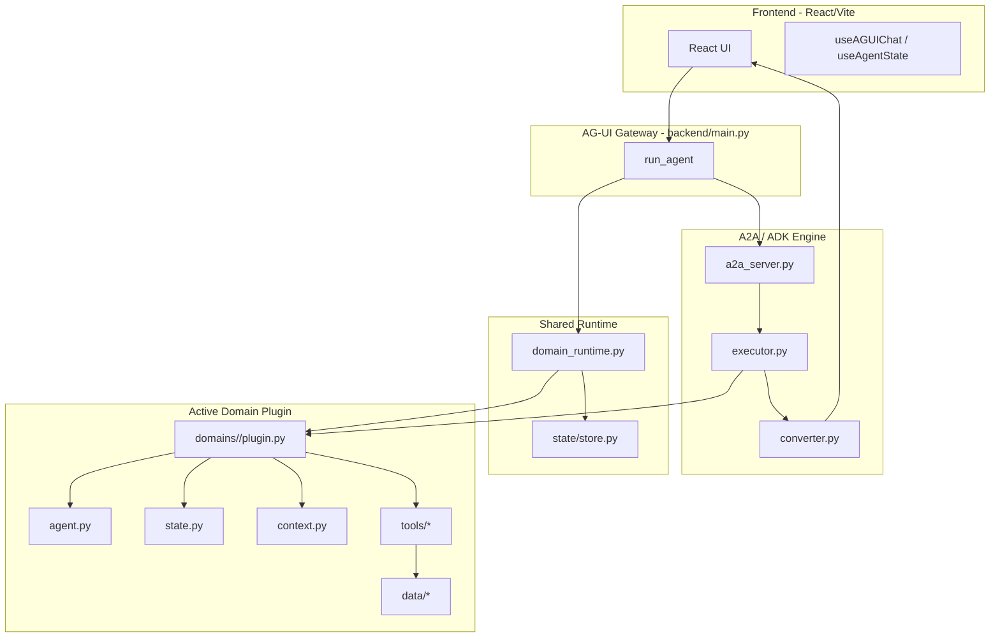
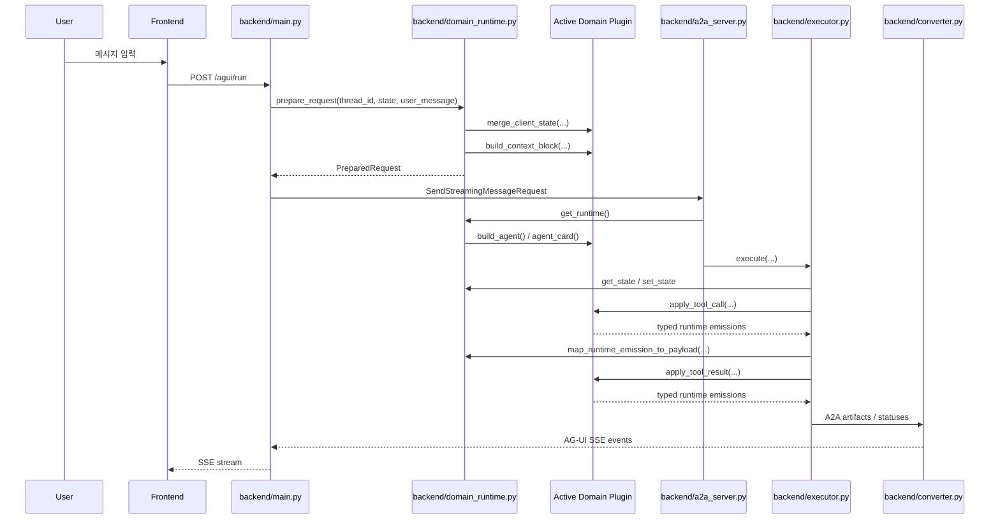

# A2A → AG-UI → Frontend 통신 흐름 상세 가이드

이 문서는 현재 구조 기준으로, **공통 채팅 엔진**과 **도메인 플러그인**이 어떻게 역할을 나눠서 통신하는지 설명합니다.

핵심 포인트는 다음 한 문장입니다.

> **공통 엔진은 채팅을 흘려보내고, 도메인 플러그인은 그 채팅의 의미를 채운다.**

---

## 목차

1. 아키텍처 개요
2. 전체 통신 흐름
3. 공통 엔진 vs 도메인 플러그인 구분
4. 레이어별 상세 분석
5. Runtime emission → AG-UI 변환
6. fake plugin 스왑 검증
7. 디버깅 포인트

---

## 아키텍처 개요

### 현재 4단계 구조



---

## 전체 통신 흐름

### 현재 요청 흐름



---

## 공통 엔진 vs 도메인 플러그인 구분

### 공통 엔진

| 파일 | 책임 | 도메인 지식 포함 여부 |
|---|---|---|
| `backend/main.py` | AG-UI 요청 수신, runtime으로 request 준비, A2A 호출 | 없음 |
| `backend/a2a_server.py` | runtime 기반 agent/card로 A2A 서버 부팅 | 없음 |
| `backend/executor.py` | ADK 실행 + runtime emission enqueue | 없음 |
| `backend/converter.py` | A2A → AG-UI 변환 | 없음 |
| `backend/domain_runtime.py` | plugin 로딩, state 저장/복원, request 준비, emission 매핑 | 없음 |
| `backend/state/store.py` | opaque state 저장 | 없음 |

이 레이어는 `destination`, `check_in`, `hotel`, `flight` 같은 의미를 직접 해석하지 않습니다.

### 도메인 플러그인

| 파일 | 책임 |
|---|---|
| `backend/domains/travel/plugin.py` | `DomainPlugin` 구현 |
| `backend/domains/travel/agent.py` | travel agent 생성 |
| `backend/domains/travel/state.py` | 상태 모델과 상태 전이 규칙 |
| `backend/domains/travel/context.py` | context block 구성 |
| `backend/domains/travel/tools/*` | 도메인 도구 |
| `backend/domains/travel/data/*` | 도메인 데이터 |
| `backend/domains/fake/plugin.py` | 스왑 검증용 최소 fake plugin |

---

## 레이어별 상세 분석

### 1. Frontend Layer

Frontend는 `/agui/run` 으로 요청을 보내고, SSE로 내려오는 AG-UI 이벤트를 처리합니다.

중요한 점은 프론트는 **도메인 플러그인의 존재를 직접 알지 못한다**는 것입니다.
프론트가 아는 것은 오직:

- `RUN_STARTED`
- `TEXT_MESSAGE_*`
- `TOOL_CALL_*`
- `STATE_DELTA`
- `STATE_SNAPSHOT`
- `USER_INPUT_REQUEST`
- `USER_FAVORITE_REQUEST`

같은 AG-UI 이벤트뿐입니다.

---

### 2. AG-UI Gateway Layer (`backend/main.py`)

현재 `main.py` 의 역할은 다음입니다.

1. `RunAgentInput` 파싱
2. 메시지 ID 자동 보정
3. 마지막 사용자 메시지 추출
4. `runtime.prepare_request(...)` 호출
5. 준비된 메시지를 A2A 요청으로 전달
6. A2A 응답을 `converter.py` 를 통해 SSE로 반환

즉 `main.py` 는 더 이상:

- travel state 구조를 직접 만지지 않고
- `ContextBuilder` 를 직접 호출하지 않으며
- 어떤 필드가 여행 날짜/목적지인지도 모릅니다.

그 책임은 runtime + plugin 쪽으로 이동했습니다.

---

### 3. Runtime Layer (`backend/domain_runtime.py`)

현재 runtime이 하는 일은 크게 4가지입니다.

#### 3.1 plugin 로딩

```python
initialize_runtime_or_die()
get_runtime()
```

`DOMAIN_PLUGIN` 환경변수로 active plugin을 로딩합니다.

지원 형식:

- `travel`
- `domains.travel.plugin:get_plugin`

환경변수가 없으면 기본적으로 `travel` 을 사용합니다.

#### 3.2 state 저장/복원

```python
get_state(thread_id)
set_state(thread_id, state)
```

여기서 저장되는 state는 **opaque** 합니다.
즉 공통 엔진은 state 안에 `destination` 이 있는지 모릅니다.

#### 3.3 request 준비

```python
prepare_request(thread_id, client_state, user_message)
```

이 메서드가 내부에서:

1. 현재 state load
2. plugin.merge_client_state(...)
3. state save
4. plugin.build_context_block(...)

까지 처리하고 `PreparedRequest` 를 반환합니다.

#### 3.4 runtime emission 매핑

```python
map_runtime_emission_to_payload(...)
```

plugin이 반환한 typed emission을 현재 stream payload 계약으로 변환합니다.

---

### 4. A2A Server Layer (`backend/a2a_server.py`)

`a2a_server.py` 는 이제 하드코딩된 travel agent를 직접 만들지 않습니다.

현재 흐름:

1. runtime 초기화
2. runtime에서 `build_agent()` 호출
3. runtime에서 `agent_card()` 호출
4. 그 agent/card를 사용해 A2A 서버 구성

즉, A2A 서버는 **공통 서버**이고,
"어떤 agent를 쓸지" 는 plugin이 결정합니다.

---

### 5. Executor Layer (`backend/executor.py`)

executor는 현재 공통 orchestration 역할을 합니다.

주요 책임:

- ADK `run_async()` 실행
- tool call 시작/종료 framing (`TOOL_CALL_START`, `TOOL_CALL_END`)
- plugin의 `apply_tool_call(...)`, `apply_tool_result(...)` 호출
- runtime emission을 payload로 변환 후 enqueue

즉 executor는:

- 툴 lifecycle은 관리하지만
- 툴 결과의 비즈니스 의미는 해석하지 않습니다.

그건 plugin이 합니다.

---

### 6. Converter Layer (`backend/converter.py`)

converter는 A2A artifact/status를 AG-UI SSE 이벤트로 변환합니다.

이 파일은 여전히 공통 계층입니다.

중요한 점:

- `STATE_DELTA` / `STATE_SNAPSHOT` / `USER_INPUT_REQUEST` / `USER_FAVORITE_REQUEST`
  의 payload는 runtime/plugin이 만들어 주고
- converter는 그 payload를 **전달 가능한 AG-UI 이벤트로 포장**합니다.

즉 converter도 도메인 의미를 해석하지 않습니다.

---

## Runtime emission → AG-UI 변환

현재 plugin이 executor로 돌려주는 typed emission은 아래 3가지입니다.

| Runtime emission | runtime payload 결과 | 최종 AG-UI 의미 |
|---|---|---|
| `RuntimeDeltaPayload` | `{ "_agui_event": "STATE_DELTA", "delta": ... }` | 상태 증분 패치 |
| `RuntimeSnapshotPayload` | snapshot 그대로 | tool result / snapshot |
| `RuntimeUiRequestPayload` | `{ "_agui_event": event_name, ...payload }` | 입력 요청 / 취향 요청 |

이를 통해 plugin은 **도메인 의미를 typed 형태로**만 반환하고,
실제 transport payload 형태는 runtime이 맞춥니다.

---

## fake plugin 스왑 검증

`backend/domains/fake/plugin.py` 는 travel 필드가 전혀 없는 최소 plugin입니다.

특징:

- 매우 작은 `FakeState`
- travel 전용 필드 없음
- 단순한 context 문자열 생성
- 최소 `AgentCard` 반환

그런데도 `/agui/run` 을 통해:

- `RUN_STARTED`
- `STEP_STARTED`
- `STEP_FINISHED`
- `RUN_FINISHED`

흐름이 그대로 지나갑니다.

이 테스트가 의미하는 것은,
현재 공통 엔진이 travel 고정이 아니라는 점입니다.

---

## 호환성 wrapper는 왜 남아 있나

분리 후에도 기존 import를 한 번에 다 깨지 않기 위해 아래 wrapper를 유지했습니다.

| 경로 | 현재 역할 |
|---|---|
| `backend/agent.py` | `domains.travel.agent` re-export |
| `backend/state/models.py` | `domains.travel.state` re-export |
| `backend/state/context_builder.py` | `domains.travel.context` re-export |
| `backend/state/manager.py` | `domains.travel.state_manager` re-export |
| `backend/data/*.py` | `domains.travel.data.*` thin wrapper |
| `backend/tools/*.py` | `domains.travel.tools.*` thin wrapper |

이 wrapper는 **구현 권한이 아니라 호환성만** 담당합니다.

---

## 디버깅 포인트

### 1. runtime 관련

확인 포인트:

- `DOMAIN_PLUGIN`
- `initialize_runtime_or_die()` 호출 여부
- `get_runtime()` 사용 위치

예:

```bash
cd backend
uv run python -c "from domain_runtime import reset_runtime_for_tests, initialize_runtime_or_die; reset_runtime_for_tests(); print(type(initialize_runtime_or_die().plugin).__name__)"
```

### 2. 전체 백엔드 검증

```bash
cd backend
DOMAIN_PLUGIN=travel uv run pytest -q
DOMAIN_PLUGIN=fake uv run pytest tests/test_domain_runtime.py tests/test_fake_plugin_smoke.py -v
```

### 3. 서버 실행

```bash
cd backend
uv run python a2a_server.py
uv run python main.py
```

---

## 요약

현재 구조는 이렇게 이해하면 됩니다.

1. `main.py` 가 요청을 받는다.
2. `domain_runtime.py` 가 active plugin으로 요청을 준비한다.
3. `a2a_server.py` 가 active plugin의 agent/card로 서버를 띄운다.
4. `executor.py` 가 plugin state 전이 결과를 runtime emission으로 받아 공통 이벤트로 흘린다.
5. `converter.py` 가 그 이벤트를 AG-UI SSE로 변환한다.
6. Frontend는 기존과 같은 AG-UI 계약만 처리한다.

즉,

> **채팅 흐름은 공통 엔진이 담당하고, 도메인 의미는 plugin이 담당한다.**
