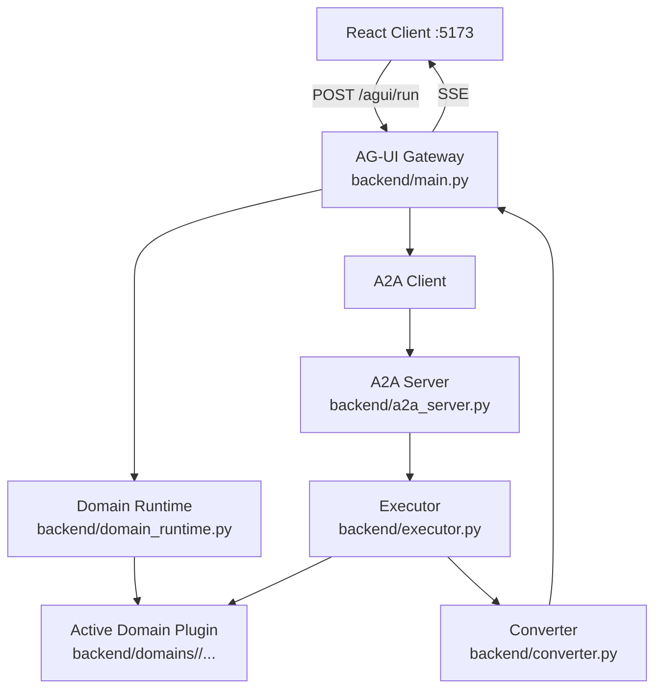

# 여행 AG-UI 채팅 — A2A + AG-UI + Domain Plugin Runtime

React + Vite 프론트엔드와 Google ADK 에이전트를 **A2A → AG-UI** 이중 프로토콜로 연결하는 여행 상담 채팅 웹입니다.

현재 백엔드는 **공통 채팅 엔진 + 도메인 플러그인** 구조로 분리되어 있습니다.

---

## 주요 기능

- **호텔 검색**: 도시, 날짜, 인원수를 기반으로 호텔 추천
- **호텔 상세 조회**: 호텔 카드 클릭 시 객실 정보, 편의시설, 위치 등 상세 정보 표시
- **항공편 검색**: 출발지, 목적지, 날짜, 인원수로 왕복 항공편 검색
- **여행 정보**: 목적지별 여행 팁 및 관광 정보 제공
- **사용자 취향 수집**: 호텔/항공편 추천 전 슬라이드업 패널로 취향 수집
- **사용자 입력 폼**: 정보가 부족할 때 대화형 폼으로 필요한 정보 수집
- **여행 컨텍스트 재사용**: 호텔↔항공편 전환 시 기존 일정/인원 자동 재사용
- **증분 상태 동기화**: `STATE_DELTA`(JSON Patch) + `STATE_SNAPSHOT` 병행
- **도메인 플러그인 구조**: travel 구현을 plugin으로 분리, fake plugin으로 스왑 가능성 검증

---

## 아키텍처



### 레이어별 역할

| 레이어 | 파일 | 역할 |
|---|---|---|
| **React Client** | `frontend/src/` | AG-UI SSE 수신 → UI 렌더링 |
| **AG-UI Gateway** | `backend/main.py` | 요청 수신, runtime으로 request 준비, A2A 호출 |
| **Domain Runtime** | `backend/domain_runtime.py` | active plugin 로딩, state 저장/복원, request 준비, runtime emission 매핑 |
| **A2A Server** | `backend/a2a_server.py` | runtime에서 agent/card를 가져와 A2A 서버 구성 |
| **Executor** | `backend/executor.py` | ADK 실행, typed runtime emission 처리 |
| **Converter** | `backend/converter.py` | A2A 이벤트 → AG-UI 이벤트 변환 |
| **Domain Plugin** | `backend/domains/travel/*` | 도메인 state 의미, context, tools, data, prompt |

---

## 공통 엔진 vs 도메인 구현

### 공통 엔진

- `backend/main.py`
- `backend/a2a_server.py`
- `backend/executor.py`
- `backend/converter.py`
- `backend/domain_runtime.py`
- `backend/state/store.py`

이 레이어는 **여행이라는 도메인을 직접 이해하지 않습니다.**

### 현재 travel 도메인 구현

- `backend/domains/travel/plugin.py`
- `backend/domains/travel/agent.py`
- `backend/domains/travel/state.py`
- `backend/domains/travel/context.py`
- `backend/domains/travel/data/*`
- `backend/domains/travel/tools/*`

### 스왑 검증용 fake 도메인

- `backend/domains/fake/plugin.py`

fake plugin으로 `/agui/run` 스모크 테스트를 통과시켜,
공통 엔진이 travel에 종속되지 않는다는 점을 검증했습니다.

---

## 프로젝트 구조

```text
travel-agui/
├── start.py
├── README.md
├── AGENT.md
├── COMMUNICATION_FLOW.md
├── docs/
│   ├── domain_separate.md
│   └── superpowers/
│       ├── specs/
│       └── plans/
├── backend/
│   ├── main.py
│   ├── a2a_server.py
│   ├── executor.py
│   ├── converter.py
│   ├── domain_runtime.py
│   ├── domains/
│   │   ├── base.py
│   │   ├── fake/
│   │   └── travel/
│   │       ├── plugin.py
│   │       ├── agent.py
│   │       ├── state.py
│   │       ├── context.py
│   │       ├── state_manager.py
│   │       ├── data/
│   │       └── tools/
│   ├── state/
│   │   ├── store.py
│   │   ├── models.py          # compatibility wrapper
│   │   ├── context_builder.py # compatibility wrapper
│   │   └── manager.py         # compatibility wrapper
│   ├── data/                  # compatibility wrappers
│   ├── tools/                 # compatibility wrappers
│   └── tests/
├── frontend/
└── openspec/
```

---

## 실행 방법

### 사전 요구사항

| 항목 | 버전 | 설치 |
|---|---|---|
| Python | 3.11+ | [python.org](https://www.python.org) |
| uv | 최신 | [astral.sh/uv](https://astral.sh/uv) |
| Node.js | 18+ | [nodejs.org](https://nodejs.org) |
| Google Gemini API Key | - | [aistudio.google.com](https://aistudio.google.com) |

---

### 빠른 시작

```bash
# 1. 환경 변수 설정
cp backend/.env.example backend/.env

# 2. backend/.env에 GOOGLE_API_KEY 입력
# DOMAIN_PLUGIN은 생략 가능하며 기본값은 travel
# Neo4j 지식그래프를 사용할 경우 TRAVEL_KNOWLEDGE_BACKEND=neo4j 유지

# 3. 백엔드 의존성 설치
cd backend && uv sync && cd ..

# 4. 프론트 의존성 설치
cd frontend && npm install && cd ..

# 5. 서버 시작
python start.py
```

기본 도메인:

```bash
DOMAIN_PLUGIN=travel
```

여행 지식그래프 조회 backend:

```bash
TRAVEL_KNOWLEDGE_BACKEND=neo4j
NEO4J_URI=bolt://localhost:7687
NEO4J_USERNAME=neo4j
NEO4J_PASSWORD=travel-agui-neo4j
NEO4J_DATABASE=neo4j
```

Neo4j 데이터를 다시 적재하려면:

```bash
cd backend
uv run python -m domains.travel.knowledge.neo4j_loader --clear
```

runtime loader는 아래 두 형태를 모두 지원합니다.

```bash
DOMAIN_PLUGIN=travel
DOMAIN_PLUGIN=domains.travel.plugin:get_plugin
```

---

## 수동 실행

```bash
# 터미널 1 — A2A 서버
cd backend
uv run python a2a_server.py

# 터미널 2 — AG-UI Gateway
cd backend
uv run python main.py

# 터미널 3 — 프론트엔드
cd frontend
npm run dev
```

서버 주소:

- A2A 서버: http://localhost:8001
- AG-UI Gateway: http://localhost:8000
- 프론트엔드 UI: http://localhost:5173

---

## 테스트

### 백엔드 전체 테스트

```bash
cd backend
uv run pytest
```

### 도메인 스왑 검증

```bash
cd backend
DOMAIN_PLUGIN=travel uv run pytest -q
DOMAIN_PLUGIN=fake uv run pytest tests/test_domain_runtime.py tests/test_fake_plugin_smoke.py -v
```

### 프론트엔드 검증

```bash
cd frontend
npm run build
npm test
```

---

## 이벤트 흐름 핵심

1. Frontend가 `/agui/run` 호출
2. `main.py`가 runtime으로 request 준비 (`prepare_request`)
3. A2A 서버가 runtime에서 active plugin의 `build_agent()` / `agent_card()` 사용
4. `executor.py`가 plugin의 `apply_tool_call()` / `apply_tool_result()` 호출
5. runtime이 typed emission을 현재 stream payload로 매핑
6. `converter.py`가 AG-UI 이벤트로 변환
7. Frontend가 `STATE_DELTA`, `STATE_SNAPSHOT`, `USER_INPUT_REQUEST`, `USER_FAVORITE_REQUEST` 처리

자세한 설명은 `COMMUNICATION_FLOW.md` 참고.

---

## 문서

- `AGENT.md` — 개발자용 구조/규칙 요약
- `COMMUNICATION_FLOW.md` — 현재 통신 흐름 상세
- `docs/domain_separate.md` — 공통 엔진 vs 도메인 플러그인 분리 설명
- `docs/superpowers/specs/2026-04-21-domain-plugin-boundary-design.md` — 설계 스펙
- `docs/superpowers/plans/2026-04-21-domain-plugin-boundary.md` — 구현 계획

---

## 트러블슈팅

### `DOMAIN_PLUGIN is not configured`

현재 runtime loader는 `DOMAIN_PLUGIN` 이 없으면 기본적으로 `travel` 을 사용합니다.

그래도 문제가 생기면 명시적으로 아래처럼 지정하세요.

```bash
export DOMAIN_PLUGIN=travel
```

또는

```bash
export DOMAIN_PLUGIN=domains.travel.plugin:get_plugin
```

### 서버 시작 실패

```bash
cd backend
uv run python a2a_server.py
uv run python main.py
```

### 포트 충돌

```bash
lsof -ti :8001 | xargs kill -9
lsof -ti :8000 | xargs kill -9
lsof -ti :5173 | xargs kill -9
```

---

## 요약

이 프로젝트는 이제

- **공통 채팅 엔진**
- **도메인 플러그인**

으로 나뉘어 있습니다.

즉, 앞으로 새 도메인을 붙일 때는 공통 채팅 흐름을 다시 만들지 않고,
`backend/domains/<domain>/...` 쪽만 구현하면 됩니다.
