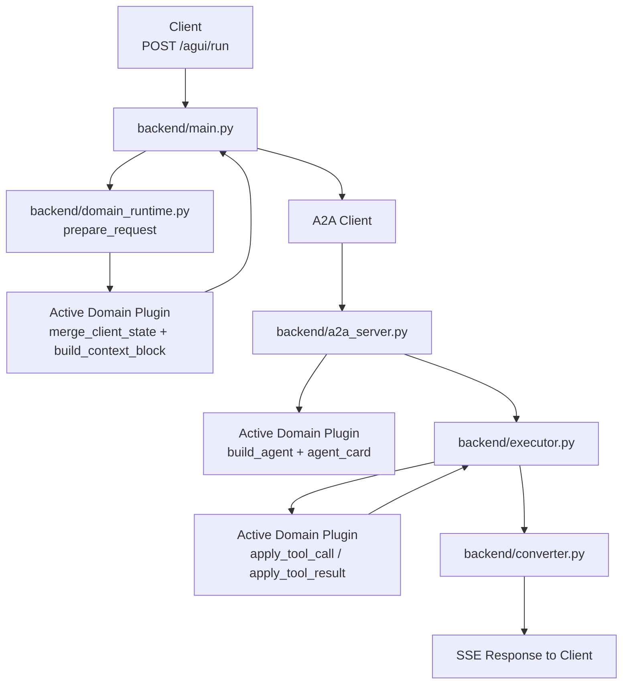

# Domain Separation Guide

## 한 줄 요약

이번 분리의 핵심은 **"채팅 엔진은 공통으로 두고, 여행/금융/커머스 같은 도메인 지식은 plugin으로 빼는 것"** 입니다.

즉, 이제는 새로운 도메인을 붙일 때:

- `main.py`, `a2a_server.py`, `executor.py`, `converter.py` 같은 **공통 채팅 흐름은 최대한 안 건드리고**
- `domains/<domain>/...` 아래의 **state / tools / data / prompt / plugin** 쪽만 교체하는 구조로 나뉘었습니다.

---

## 왜 이렇게 나눴나

기존 구조에서는 여행 도메인 로직이 아래 공통 흐름 파일들 사이에 섞여 있었습니다.

- 요청 받기 (`main.py`)
- A2A 서버 띄우기 (`a2a_server.py`)
- ADK 실행 이벤트 처리 (`executor.py`)
- 스트리밍 응답 변환 (`converter.py`)

이 상태에서는 도메인이 바뀔 때마다 “채팅이 어떻게 흐르는지”와 “도메인 데이터가 무엇인지”를 같이 수정해야 했습니다.

지금은 그 둘을 분리해서:

1. **공통 엔진(Common Engine)** = 채팅 transport / orchestration
2. **도메인 플러그인(Domain Plugin)** = 상태 의미, 도구, 데이터, 프롬프트

로 경계를 정했습니다.

---

## 전체 구조

### 1) 공통 엔진

이 레이어는 **도메인이 무엇인지 몰라도** 돌아가야 하는 파일들입니다.

| 파일 | 역할 | 도메인 지식 포함 여부 |
|---|---|---|
| `backend/main.py` | AG-UI 요청 수신, runtime으로 상태 준비, A2A 요청 전달, SSE 응답 반환 | 없음 |
| `backend/a2a_server.py` | A2A 서버 부팅, runtime에서 agent/card 가져오기 | 없음 |
| `backend/executor.py` | ADK 실행, tool call / tool result lifecycle 처리 | 없음 |
| `backend/converter.py` | A2A 이벤트를 AG-UI 이벤트로 변환 | 없음 |
| `backend/domain_runtime.py` | active plugin 로딩, state 저장/복원, request 준비, runtime emission 매핑 | 없음 |
| `backend/state/store.py` | plugin state를 opaque하게 저장 | 없음 |

이 레이어는 **"여행인지 아닌지"를 판단하지 않습니다.**

---

### 2) 도메인 플러그인

이 레이어는 **도메인의 의미를 아는 곳**입니다.

| 파일/폴더 | 역할 |
|---|---|
| `backend/domains/travel/plugin.py` | travel domain의 메인 진입점 (`DomainPlugin` 구현) |
| `backend/domains/travel/agent.py` | travel 전용 ADK agent 생성 |
| `backend/domains/travel/state.py` | travel state 모델 + 상태 전이 규칙 |
| `backend/domains/travel/context.py` | travel context block 생성 |
| `backend/domains/travel/data/*` | 여행 데이터 소스 |
| `backend/domains/travel/tools/*` | 여행 도구 구현 |
| `backend/domains/fake/plugin.py` | 스왑 가능성 검증용 최소 fake domain |

즉, **도메인을 바꾸고 싶으면 여기만 갈아끼우면 되는 구조**입니다.

---

## 실제 경계선은 어디인가

이번 설계에서 가장 중요한 기준은 이것입니다.

> **공통 엔진은 domain state의 의미를 모른다.**

예를 들어 공통 엔진은 아래를 몰라야 합니다.

- `destination`
- `check_in`
- `check_out`
- 호텔/항공편 의미
- 여행 취향 필드 의미

이런 의미는 전부 `domains/travel/state.py`, `domains/travel/context.py`, `domains/travel/plugin.py` 안에 있어야 합니다.

---

## 분리 기준 표

### 공통 엔진에 둔 것

| 구분 | 설명 | 예시 |
|---|---|---|
| Request/Response transport | HTTP/SSE/A2A 연결 자체 | `main.py`, `converter.py` |
| Runtime lifecycle | plugin 로딩, state 저장/복원, request 준비 | `domain_runtime.py` |
| ADK 실행 orchestration | runner 실행, 텍스트/툴 이벤트 라우팅 | `executor.py` |
| Event framing | `RUN_STARTED`, `RUN_FINISHED`, `STATE_DELTA` 등 이벤트 구조 유지 | `converter.py`, `executor.py` |

### 도메인 쪽으로 뺀 것

| 구분 | 설명 | 예시 |
|---|---|---|
| Domain state meaning | 어떤 필드가 무엇을 뜻하는지 | `domains/travel/state.py` |
| Context building | state를 어떤 문장으로 프롬프트 앞에 주입할지 | `domains/travel/context.py` |
| Prompt / agent behavior | LLM instruction, tool 목록 | `domains/travel/agent.py` |
| Business tools | 호텔/항공/팁/입력/취향 수집 도구 | `domains/travel/tools/*` |
| Business data | 호텔/항공/팁/선호도 데이터 | `domains/travel/data/*` |

---

## 흐름으로 보면 어떻게 나뉘는가



이 흐름에서 중요한 점은:

- `main.py`, `a2a_server.py`, `executor.py`, `converter.py`는 **항상 공통 흐름**
- plugin은 중간중간 **도메인 의미를 해석하는 역할만** 수행

입니다.

---

## 요청 기준으로 보면

### 1. 요청이 들어오면

`backend/main.py`가 요청을 받습니다.

여기서는:

- 메시지 추출
- runtime 초기화
- 현재 thread state 불러오기
- plugin으로 client state merge
- plugin으로 context block 생성

까지 하고, 이후 A2A 요청으로 넘깁니다.

즉 `main.py`는 **도메인 state의 의미는 모르고**,
그냥 `runtime.prepare_request(...)`를 호출해서 **준비된 메시지**를 받습니다.

---

### 2. agent 실행 시

`backend/a2a_server.py`는 runtime에게서:

- `build_agent()`
- `agent_card()`

를 받아서 A2A 서버를 구성합니다.

즉 서버 자체는 공통이고,
**어떤 agent를 붙일지**만 plugin이 결정합니다.

---

### 3. tool call / tool result 처리 시

`backend/executor.py`는 tool call을 직접 해석하지 않고,
plugin에게 위임합니다.

예를 들어:

- `search_hotels` 호출 시 state를 어떻게 바꿀지
- `request_user_input` 결과를 어떤 payload로 바꿀지
- `USER_FAVORITE_REQUEST`를 어떤 형태로 emit할지

이건 전부 domain plugin이 결정합니다.

executor는 그냥:

1. plugin이 준 typed emission을 받고
2. runtime helper로 현재 stream payload 형태로 변환하고
3. 공통 이벤트로 내보냅니다.

즉 executor는 **이벤트를 운반**하지,
**이벤트의 비즈니스 의미를 해석하지 않습니다.**

---

## 왜 fake plugin을 만들었나

travel plugin만 있으면 “분리된 것처럼 보이는 구조”일 수는 있어도,
정말 교체 가능한지는 증명되지 않습니다.

그래서 `backend/domains/fake/plugin.py` 를 추가했습니다.

이 fake plugin은:

- travel 필드가 없음
- 아주 작은 state만 가짐
- 간단한 context string만 만듦
- 최소 `AgentCard`만 반환

그런데도 `/agui/run` 요청이 정상적으로

- `RUN_STARTED`
- `STEP_STARTED`
- `STEP_FINISHED`
- `RUN_FINISHED`

흐름으로 통과합니다.

이게 의미하는 것은:

> **공통 엔진은 travel 전용 코드가 아니고, 다른 domain도 실제로 꽂을 수 있다**

는 것입니다.

---

## 기존 파일은 어떻게 처리했나

한 번에 모든 import 경로를 깨지 않기 위해,
기존 위치의 일부 파일은 **compatibility wrapper**로 남겼습니다.

예:

| 기존 경로 | 지금 역할 |
|---|---|
| `backend/agent.py` | `domains.travel.agent` re-export |
| `backend/state/models.py` | `domains.travel.state` re-export |
| `backend/state/context_builder.py` | `domains.travel.context` re-export |
| `backend/state/manager.py` | `domains.travel.state_manager` re-export |
| `backend/data/*.py` | `domains.travel.data.*` thin wrapper |
| `backend/tools/*.py` | `domains.travel.tools.*` thin wrapper |

즉, **기존 import를 당장 다 깨지 않으면서도 실제 구현 권한은 domain 쪽으로 이동**시켰습니다.

---

## 앞으로 새 도메인을 붙일 때 필요한 것

예를 들어 `finance` 도메인을 붙인다고 하면, 공통 엔진은 그대로 두고 아래만 만들면 됩니다.

```text
backend/domains/finance/
  plugin.py
  agent.py
  state.py
  context.py
  data/
  tools/
```

그리고 환경변수만 바꾸면 됩니다.

```env
DOMAIN_PLUGIN=domains.finance.plugin:get_plugin
```

즉, **새 도메인 추가 = plugin 추가** 로 바뀐 겁니다.

---

## 최종적으로 얻은 것

이번 분리로 얻은 가장 큰 이점은 3가지입니다.

1. **공통 채팅 흐름 재사용 가능**  
   도메인이 바뀌어도 `main.py → a2a_server.py → executor.py → converter.py` 흐름은 그대로 갑니다.

2. **도메인 개발 포인트가 명확해짐**  
   이제는 “호텔/항공 대신 어떤 데이터와 도구가 필요한가?”만 생각하면 됩니다.

3. **교체 가능성이 실제로 검증됨**  
   fake plugin으로 `/agui/run` 스모크 테스트까지 통과했기 때문에, 설계만이 아니라 구현 수준에서도 swap 가능성이 확인됐습니다.

---

## 가장 중요한 문장 다시 정리

> **공통 엔진은 채팅을 흘려보내고, 도메인 플러그인은 그 채팅의 의미를 채운다.**

이게 이번 분리의 핵심입니다.
