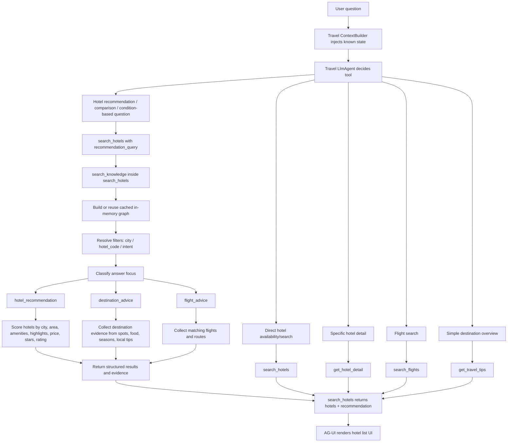
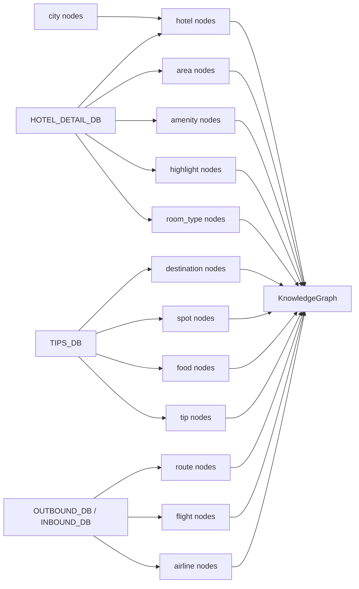
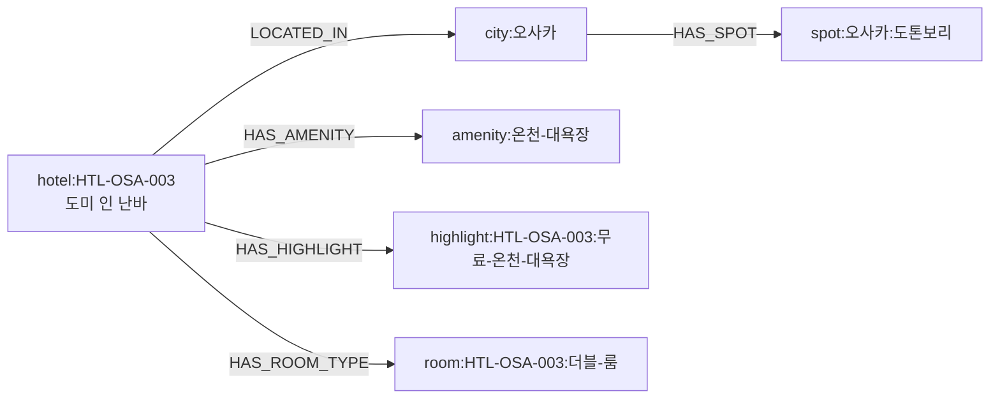

# Travel GraphRAG Implementation Summary

## 목적

`backend/domains/travel/data/` 아래의 정적 여행 데이터를 지식 그래프 형태로 정리하고, 상담 에이전트가 단순 검색을 넘어 추천, 비교, 조건형 질문, 여행 조언 질문에 대응할 수 있도록 `GraphRAG-lite` 계층을 추가했다.

이번 구현은 외부 graph DB, vector DB, embedding 모델을 쓰지 않는다. 현재 샘플 앱의 데이터가 Python dict 기반 정적 데이터이므로, travel 도메인 내부에서 in-memory graph를 만들고 deterministic scoring으로 검색한다.

## 구성 파일

```text
backend/domains/travel/
  knowledge/
    __init__.py
    graph.py
    index.py
    retrieval.py
  tools/
    knowledge_tools.py
    __init__.py
  agent.py

backend/tests/travel/
  test_knowledge_graph.py
  test_knowledge_tool.py
```

## 역할 분리

### `knowledge/graph.py`

지식 그래프의 기본 자료구조를 정의한다.

- `KnowledgeNode`: 도시, 호텔, 편의시설, 관광지, 음식, 팁, 항공편 같은 지식 단위
- `KnowledgeEdge`: 노드 간 관계
- `KnowledgeGraph`: node/edge 저장, outgoing/incoming 조회, type 기반 node 조회

그래프 계층은 외부 라이브러리에 의존하지 않는다.

### `knowledge/index.py`

기존 정적 데이터를 graph node/edge로 변환한다.

입력 데이터:

- `HOTEL_DETAIL_DB`
- `TIPS_DB`
- `OUTBOUND_DB`
- `INBOUND_DB`

주요 node type:

- `city`
- `hotel`
- `area`
- `amenity`
- `highlight`
- `room_type`
- `destination`
- `spot`
- `food`
- `tip`
- `route`
- `flight`
- `airline`

주요 edge type:

- `LOCATED_IN`
- `LOCATED_IN_AREA`
- `HAS_AMENITY`
- `HAS_HIGHLIGHT`
- `HAS_ROOM_TYPE`
- `HAS_DESTINATION_INFO`
- `HAS_SPOT`
- `HAS_FOOD`
- `HAS_TIP`
- `DEPARTS_FROM`
- `ARRIVES_AT`
- `HAS_FLIGHT`
- `OPERATED_BY`

### `knowledge/retrieval.py`

사용자 질문을 받아 graph에서 답변 근거를 찾는다.

진입 함수:

```python
search_knowledge(query: str, city: str = "", hotel_code: str = "", intent: str = "") -> dict
```

검색 방식:

- query normalize
- city 또는 hotel_code filter 해석
- 질문 유형 분류
  - `hotel_recommendation`
  - `destination_advice`
  - `flight_advice`
- 호텔 점수 계산
  - 도시/지역 매치
  - 호텔명/설명/편의시설/하이라이트/객실 타입 token overlap
  - 가성비/저렴/예산 query는 낮은 가격 우선
  - 럭셔리/5성 query는 stars/rating 우선
- 여행지 조언 evidence 수집
  - 관광지, 음식, best season, currency, language, tips
- 항공 관련 query는 flight node를 가격순으로 반환

### `tools/knowledge_tools.py`

GraphRAG 검색 wrapper다. 현재 agent-facing 최종 도구로 직접 등록하지 않고, 호텔 리스트 UI가 필요한 흐름에서는 `search_hotels` 내부 ranking/filter 엔진으로 사용한다.

```python
search_travel_knowledge(
    query: str,
    city: str = "",
    hotel_code: str = "",
    intent: str = "",
) -> dict
```

내부적으로 `search_knowledge()`를 호출한다. tool 응답은 `results`, `evidence`, `suggested_next_actions`를 포함하지만, 호텔 리스트 UI를 보여줘야 하는 대화에서는 이 wrapper가 아니라 `search_hotels`가 최종 snapshot을 내려야 한다.

### `tools/hotel_tools.py`

호텔 리스트 UI는 frontend가 `tool === "search_hotels"` snapshot을 보고 렌더링한다. 그래서 조건 기반 호텔 추천의 최종 도구는 `search_hotels`로 유지한다.

`search_hotels`에 `recommendation_query` 인자를 추가했다.

```python
search_hotels(
    city: str,
    check_in: str,
    check_out: str,
    guests: int = 2,
    recommendation_query: str = "",
) -> dict
```

동작:

- `recommendation_query`가 없으면 기존과 동일하게 도시별 호텔 리스트를 반환한다.
- `recommendation_query`가 있으면 내부에서 `search_knowledge()`를 호출한다.
- GraphRAG가 반환한 `hotel_code` 순서로 기존 `hotels` 리스트를 정렬한다.
- 반환 payload는 기존 `search_hotels` shape를 유지하고, 부가 정보로 `recommendation`을 추가한다.

### `agent.py`

기존 travel agent는 호텔 리스트 UI를 위해 `search_hotels`를 최종 도구로 사용한다. `search_travel_knowledge`는 agent tool 목록에 직접 등록하지 않는다.

또한 agent instruction에 다음 규칙을 추가했다.

- 단순 예약/조회는 기존 tool 사용
  - `search_hotels`
  - `get_hotel_detail`
  - `search_flights`
  - `get_travel_tips`
- 호텔 추천, 비교, 조건형 상담은 `search_hotels(..., recommendation_query="사용자 원문 조건")` 사용
- `evidence`에 없는 사실은 단정하지 않음

추가 보정:

- 날짜, 인원, 출발지, 목적지 같은 상세 정보 수집이 필요하면 `request_user_input`이 1순위다.
- `request_user_input`이 필요한 턴에서는 `search_hotels`를 함께 호출하지 않는다.
- `request_user_input` 호출 후에는 사용자 응답을 기다리고, 상세 정보 수집이 완료된 다음 턴부터 GraphRAG 검색을 진행한다.
- 호텔 조건 추천의 최종 도구는 `search_hotels`다.
- 조건 추천/비교 질문은 `search_hotels(..., recommendation_query="사용자 원문 조건")`로 호출한다.
- `search_travel_knowledge`는 agent가 직접 호출하지 않는다. 호텔 리스트 UI를 위해 최종 snapshot은 `search_hotels`가 내려야 한다.

## 전체 처리 흐름



## Graph 생성 흐름



## 데이터 노드 구성

지식 그래프는 `backend/domains/travel/data/`의 Python dict를 node와 edge로 변환해서 만든다. node id는 재현 가능하도록 source key를 기반으로 만든다.

### Node Type 목록

| node type | node id 예시 | source data | 주요 properties | 설명 |
| --- | --- | --- | --- | --- |
| `city` | `city:오사카` | 호텔, 팁, 항공 route의 city 값 | `city` | 모든 지역 정보의 기준 node |
| `hotel` | `hotel:HTL-OSA-003` | `HOTEL_DETAIL_DB` | `hotel_code`, `city`, `area`, `price`, `stars`, `rating`, `description`, `address`, `phone`, `check_in_time`, `check_out_time`, `cancel_policy`, `amenities`, `highlights` | 호텔 추천/비교의 중심 node |
| `area` | `area:오사카:난바` | `HOTEL_DETAIL_DB[*].area` | `city` | 도시 내 세부 지역 |
| `amenity` | `amenity:온천-대욕장` | `HOTEL_DETAIL_DB[*].amenities` | 없음 | 호텔 편의시설 |
| `highlight` | `highlight:HTL-OSA-003:무료-온천-대욕장` | `HOTEL_DETAIL_DB[*].highlights` | 없음 | 호텔별 강조 포인트 |
| `room_type` | `room:HTL-OSA-003:더블-룸` | `HOTEL_DETAIL_DB[*].room_types` | 객실 원본 필드 + `hotel_code` | 객실 타입, 가격, 정원, 침대 정보 |
| `destination` | `destination:방콕` | `TIPS_DB` | `city`, `overview`, `best_season`, `currency`, `language`, `spots`, `food`, `tips` | 여행지 전체 정보 |
| `spot` | `spot:방콕:왓-아룬` | `TIPS_DB[*].spots` | `city` | 관광지 |
| `food` | `food:오사카:타코야키` | `TIPS_DB[*].food` | `city` | 대표 음식 |
| `tip` | `tip:방콕:사원-방문-시-긴-옷-착용` | `TIPS_DB[*].tips` | `city` | 여행 팁/주의사항 |
| `route` | `route:서울:오사카:outbound` | `OUTBOUND_DB`, `INBOUND_DB` | `origin`, `destination`, `direction` | 항공 노선 |
| `flight` | `flight:KE723` | `OUTBOUND_DB`, `INBOUND_DB` | 항공편 원본 필드 + `origin`, `destination`, `direction` | 개별 항공편 |
| `airline` | `airline:대한항공` | 항공편의 `airline` 값 | 없음 | 항공사 |

### Edge 구성

| edge type | source -> target 예시 | 의미 |
| --- | --- | --- |
| `LOCATED_IN` | `hotel:HTL-OSA-003` -> `city:오사카` | 호텔이 어느 도시에 있는지 |
| `LOCATED_IN_AREA` | `hotel:HTL-OSA-003` -> `area:오사카:난바` | 호텔이 어느 세부 지역에 있는지 |
| `HAS_AMENITY` | `hotel:HTL-OSA-003` -> `amenity:온천-대욕장` | 호텔이 가진 편의시설 |
| `HAS_HIGHLIGHT` | `hotel:HTL-OSA-003` -> `highlight:HTL-OSA-003:무료-온천-대욕장` | 호텔별 장점/특징 |
| `HAS_ROOM_TYPE` | `hotel:HTL-OSA-003` -> `room:HTL-OSA-003:더블-룸` | 호텔의 객실 타입 |
| `HAS_DESTINATION_INFO` | `city:방콕` -> `destination:방콕` | 도시의 여행지 요약 정보 |
| `HAS_SPOT` | `city:방콕` -> `spot:방콕:왓-아룬` | 도시의 관광지 |
| `HAS_FOOD` | `city:오사카` -> `food:오사카:타코야키` | 도시의 대표 음식 |
| `HAS_TIP` | `city:방콕` -> `tip:방콕:사원-방문-시-긴-옷-착용` | 도시의 여행 팁 |
| `DEPARTS_FROM` | `route:서울:오사카:outbound` -> `city:서울` | 노선 출발지 |
| `ARRIVES_AT` | `route:서울:오사카:outbound` -> `city:오사카` | 노선 도착지 |
| `HAS_FLIGHT` | `route:서울:오사카:outbound` -> `flight:KE723` | 노선에 포함된 항공편 |
| `OPERATED_BY` | `flight:KE723` -> `airline:대한항공` | 항공편 운항사 |

### 예시 Subgraph

`"오사카에서 온천 있는 숙소 추천"` 질의에서는 아래와 같은 노드가 핵심 근거로 쓰인다.



이 구조 때문에 retrieval은 단순히 호텔명만 보는 것이 아니라, 도시, 지역, 편의시설, 하이라이트, 객실, 여행지 정보를 함께 근거로 삼을 수 있다.

## Tool 선택 기준

| 사용자 질문 | 사용 tool |
| --- | --- |
| "도쿄 호텔 6월 10일부터 2명 찾아줘" | `search_hotels` |
| "HTL-SEO-001 상세 알려줘" | `get_hotel_detail` |
| "서울에서 오사카 항공편 알려줘" | `search_flights` |
| "방콕 여행 팁 알려줘" | `get_travel_tips` |
| "오사카에서 온천 있는 숙소 추천해줘" + 날짜/인원 있음 | `search_hotels(..., recommendation_query="오사카에서 온천 있는 숙소 추천해줘")` |
| "수영장 있는 서울 5성 호텔 비교해줘" + 날짜/인원 있음 | `search_hotels(..., recommendation_query="수영장 있는 서울 5성 호텔 비교해줘")` |
| "방콕 사원 방문할 때 주의할 점 알려줘" | `get_travel_tips` |
| "도쿄 가성비 호텔 추천해줘" + 날짜/인원 있음 | `search_hotels(..., recommendation_query="도쿄 가성비 호텔 추천해줘")` |
| "도쿄 호텔 추천해줘" + 날짜/인원 없음 | `request_user_input` 먼저, 다음 턴에 `search_hotels(..., recommendation_query=...)` |
| "제주도 4성급 호텔 중 무료 주차 가능한 곳 추천해줘" + 날짜/인원 있음 | `search_hotels(..., recommendation_query="제주도 4성급 호텔 중 무료 주차 가능한 곳 추천해줘")` |

## 응답 구조

`search_hotels`는 UI 호환을 위해 기존 `hotels` payload를 유지한다. 조건 추천일 때만 `recommendation` 메타를 추가한다.

```python
{
    "status": "success",
    "city": "제주",
    "check_in": "2026-06-10",
    "check_out": "2026-06-14",
    "guests": 2,
    "count": 3,
    "hotels": [...],
    "recommendation": {
        "query": "...",
        "matched_hotel_codes": [...],
        "answer_focus": "hotel_recommendation",
        "evidence": [...]
    }
}
```

## 예시 동작

### "오사카에서 온천 있는 숙소 추천"

- city filter: `오사카`
- answer focus: `hotel_recommendation`
- graph traversal:
  - `city:오사카`
  - `hotel:HTL-OSA-003`
  - `amenity:온천-대욕장`
  - `highlight:무료-온천-대욕장`
- expected top result:
  - `HTL-OSA-003`, `도미 인 난바`

### "도쿄 가성비 호텔"

- city filter: `도쿄`
- budget term detected: `가성비`
- ranking:
  - price ascending
  - score fallback
- expected behavior:
  - 더 저렴한 호텔이 상단에 온다.

### "방콕 사원 방문 주의할 점"

- city filter: `방콕`
- answer focus: `destination_advice`
- evidence:
  - `사원 방문 시 긴 옷 착용`
  - 방콕 destination tips

## 오류 처리

| 상황 | 반환 |
| --- | --- |
| 빈 query | `status: invalid_request` |
| 알 수 없는 city | `status: not_found`, `known_cities` 포함 |
| 알 수 없는 hotel_code | `status: not_found` |
| 강한 match 없음 | `status: not_found`, 재질문 가이드 포함 |

## 로그

`backend/domains/travel/knowledge/retrieval.py`에 Python 표준 logging을 추가했다.

logger 이름:

```text
domains.travel.knowledge.retrieval
```

로그 목적:

- 어떤 사용자 입력이 GraphRAG 검색으로 들어왔는지 확인
- city, hotel_code, intent filter가 어떻게 해석됐는지 확인
- 어떤 graph evidence node가 최종 답변 근거로 사용됐는지 확인
- 최종 매칭된 호텔, 여행지 evidence, 항공편 결과를 확인
- `invalid_request`, `not_found`의 원인을 확인

로그 레벨:

- `INFO`: 요청, filter 해석, 사용 evidence node, 최종 매칭 결과, not_found/invalid_request
- `DEBUG`: 호텔 후보별 score

예시:

```text
[travel-knowledge] query received query='오사카에서 온천 있는 숙소 추천' city='오사카' hotel_code='' intent=''
[travel-knowledge] filters resolved matched_city='오사카' hotel_code='' answer_focus='hotel_recommendation'
[travel-knowledge] graph evidence nodes used=[{'id': 'hotel:HTL-OSA-003', 'label': '도미 인 난바', 'type': 'hotel'}, {'id': 'amenity:온천-대욕장', 'label': '도미 인 난바', 'type': 'has_amenity'}]
[travel-knowledge] final hotel matches count=3 top=['HTL-OSA-003:도미 인 난바', 'HTL-OSA-001:콘래드 오사카', 'HTL-OSA-002:더블트리 힐튼 오사카']
```

후보 점수까지 보고 싶으면 해당 logger의 DEBUG 로그를 켜면 된다.

```text
[travel-knowledge] hotel candidate hotel_code='HTL-OSA-003' name='도미 인 난바' score=15.00
```

## 테스트

추가된 테스트:

```text
backend/tests/travel/test_knowledge_graph.py
backend/tests/travel/test_knowledge_tool.py
```

검증 범위:

- graph에 city/hotel/amenity edge가 생성되는지
- destination tip node가 생성되는지
- 온천 숙소 query가 `도미 인 난바`를 찾는지
- 가성비 query가 가격순 ranking을 적용하는지
- 방콕 사원 주의사항 evidence를 찾는지
- unknown city를 `not_found`로 처리하는지
- GraphRAG 요청/필터/evidence node/최종 호텔 매칭 로그가 남는지
- agent instruction이 `request_user_input` 우선순위를 명시하는지
- agent instruction이 호텔 조건 추천의 최종 도구를 `search_hotels`로 명시하는지
- `search_hotels`가 `recommendation_query`를 받아 GraphRAG 순서로 호텔 리스트를 정렬하는지
- `recommendation_query`가 없을 때 기존 `search_hotels` payload shape가 유지되는지
- `search_travel_knowledge` tool 응답 구조
- agent에 `search_travel_knowledge`가 직접 등록되지 않고 `search_hotels`가 등록되는지

실행 결과:

```bash
cd backend && uv run pytest -q
# 115 passed, 2 warnings
```

## 현재 한계와 확장 방향

현재 구현은 deterministic keyword/token 기반이다. 그래서 동의어, 오탈자, 문장 의미 유사도까지 깊게 처리하지는 않는다.

다음 확장 후보:

- amenity/travel-purpose alias 사전 추가
- query intent classifier 강화
- embedding 기반 semantic ranking 추가
- graph snapshot persistence
- knowledge result 전용 UI card 추가
- 실제 운영 데이터 연동
